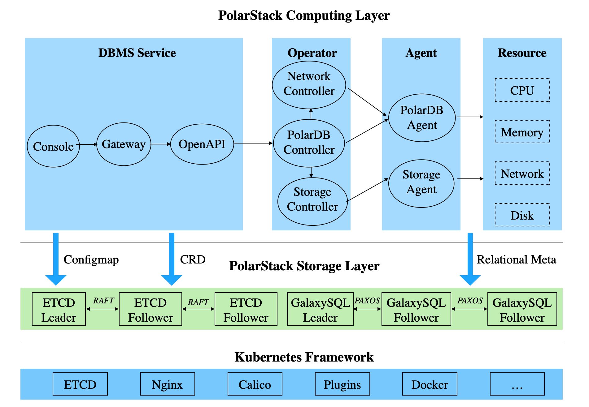

<div align="center">

[](https://developer.aliyun.com/topic/polardb-for-pg)

# PolarDB for PostgreSQL

**A cloud-native database service independently developed by Alibaba Cloud**

[](https://developer.aliyun.com/topic/polardb-for-pg)

[](https://github.com/ApsaraDB/PolarDB-for-PostgreSQL/actions/workflows/build-and-test.yml)
[](https://github.com/ApsaraDB/PolarDB-for-PostgreSQL/actions/workflows/build-and-test.yml)
[](https://github.com/ApsaraDB/PolarDB-for-PostgreSQL/actions/workflows/build-and-test.yml)
[](doc/PolarDB-EN/LICENSE.txt)
[](https://GitHub.com/ApsaraDB/PolarDB-for-PostgreSQL/issues)
[](https://GitHub.com/ApsaraDB/PolarDB-for-PostgreSQL/pulls)
[](https://github.com/ApsaraDB/PolarDB-for-PostgreSQL/network/members)
[](https://github.com/ApsaraDB/PolarDB-for-PostgreSQL/stargazers)
[](https://github.com/ApsaraDB/PolarDB-for-PostgreSQL/graphs/contributors)

</div>

# Overview


PolarDB PostgreSQL (hereafter simplified as PolarDB) is a cloud native database service independently developed by Alibaba Cloud. This service is 100% compatible with PostgreSQL and uses a shared-storage-based architecture in which computing is decoupled from storage. This service features flexible scalability, millisecond-level latency and hybrid transactional/analytical processing (HTAP) capabilities.

1. Flexible scalability: You can use the service to scale out a compute cluster or a storage cluster based on your business requirements.
    - If the computing power is insufficient, you can scale out only the compute cluster.
    - If the storage capacity or the storage I/O is insufficient, you can scale out a storage cluster without interrupting your service.
2. Millisecond-level latency:
    - Write-ahead logging (WAL) logs are stored in the shared storage. Only the metadata of WAL records is replicated from the read-write node to read-only nodes.
    - The *LogIndex* technology provided by PolarDB features two record replay modes: lazy replay and parallel replay. The technology can be used to minimize the record replication latency from the read-write node to read-only nodes.
3. HTAP: HTAP is implemented by using a shared-storage-based massively parallel processing (MPP) architecture. The architecture is used to accelerate online analytical processing (OLAP) queries in online transaction processing (OLTP) scenarios. PolarDB supports a complete suite of data types that are used in OLTP scenarios. PolarDB supports two computing engines that can process these types of data:
    - Standalone execution: processes OLTP queries that feature high concurrency.
    - Distributed execution: processes large OLAP queries.

PolarDB provides a wide range of innovative multi-model database capabilities to help you process, analyze, and search for different types of data, such as spatio-temporal, geographic information system (GIS), image, vector, and graph data.

Besides the **Shared-Storage** architecture mentioned above, PolarDB also supports depolyments in **Shared-Nothing** architecture. For more details, refer to [README](https://github.com/ApsaraDB/PolarDB-for-PostgreSQL/blob/distributed/README.md) in the **distributed** branch.

# Architecture and Roadmap

PolarDB uses a shared-storage-based architecture in which computing is decoupled from storage. The conventional shared-nothing architecture is changed to the shared-storage architecture. N copies of data in the compute cluster and N copies of data in the storage cluster are changed to N copies of data in the compute cluster and one copy of data in the storage cluster. The shared storage stores one copy of data, but the data states in memory are different. The WAL logs must be synchronized from the primary node to read-only nodes to ensure data consistency. In addition, when the primary node flushes dirty pages, it must be controlled to prevent the read-only nodes from reading future pages. Meanwhile, the read-only nodes must be prevented from reading the outdated pages that are not correctly replayed in memory. To resolve this issue, PolarDB provides the index structure *LogIndex* to maintain the page replay history. LogIndex can be used to synchronize data from the primary node to read-only nodes.

After computing is decoupled from storage, the I/O latency and throughput increase. When a single read-only node is used to process analytical queries, the CPUs, memory, and I/O of other read-only nodes and the large storage I/O bandwidth cannot be fully utilized. To resolve this issue, PolarDB provides the shared-storage-based MPP engine. The engine can use CPUs to accelerate analytical queries at SQL level and support a mix of OLAP workloads and OLTP workloads for HTAP.

For more information, see [Roadmap](doc/PolarDB-EN/Roadmap.md) and [Architecture](doc/PolarDB-EN/Architecture.md).

# Branch Introduction

20210901: The default branch of PolarDB switched to **main** on 20210901, which supports compute-storage-separation architecture. The “POLARDB_11_STABLE” is the stable branch which is based on PostgreSQL 11.9. The original **master** branch in the past has been switched to **distributed** branch, which supports distributed architecture of PolarDB.

# Documentation

- [Architecture Design](doc/PolarDB-EN/Architecture.md)
- [Roadmap](doc/PolarDB-EN/Roadmap.md)
- Features of PolarDB PostgreSQL 1.0
    - [Buffer Management](doc/PolarDB-EN/Buffer_Management.md)
    - [DDL Synchronization](doc/PolarDB-EN/DDL_Synchronization.md)
    - [LogIndex](doc/PolarDB-EN/LogIndex.md)
- DB Monitoring
- [PolarDB Stack](https://github.com/ApsaraDB/PolarDB-Stack-Operator/blob/master/README.md)
- PolarDB File System

# Quick Start with PolarDB

Three approaches are offered to quickly try out PolarDB: Alibaba Cloud service, deployment of instance based on local storage, and deployment of instance based on PolarDB Stack.

## Alibaba Cloud Service

Alibaba provides ApsaraDB for PolarDB PostgreSQL-Compatible Edition, which is a cloud-native relational database service compatible with PostgreSQL: [Official site](https://www.alibabacloud.com/product/polardb).

## Deploy Instance based on Local Storage

We provide a script which uses default configuration to compile PolarDB. This section describes how to fast deploy a PolarDB instance with storage on your local disks by this script.

**System Requirements**: CentOS 7.5 and above. The following setup steps are tested on CentOS 7.5. 

> **Note**: For the following steps, please use the same user. DO NOT use *root* user to create instances.

1. Download the stable branch "POLARDB_11_STABLE" of PolarDB from [here](https://github.com/ApsaraDB/PolarDB-for-PostgreSQL/tree/POLARDB_11_STABLE).
2. Install dependent packages:

    ```bash
    sudo yum install readline-devel zlib-devel perl-CPAN bison flex
    sudo cpan -fi Test::More IPC::Run
    ```
3. Select the coommand according to your actual needs to start deployment.
    - Run the following commands to compile the source code only, without creating any instance:

        ```bash
        ./polardb_build.sh --noinit
        ```
    - Run the following commands to compile the source code, and create an instance with one node (primary node). The port number is 5432.

        ```bash
        ./polardb_build.sh
        ```
    - Run the following commands to compile the source code, and create an instance with two nodes. The nodes include:
        - One primary node and the port number is 5432.
        - One read-only node and the port number is 5433.

        ```bash
        ./polardb_build.sh --withrep --repnum=1
        ```
    - Run the following commands to compile the source code, and create an instance with three nodes. The nodes include:
        - One primary node and the port number is 5432.
        - One read-only node and the port number is 5433.
        - One standby node (for standby database) and the port number is 5434.

        ```bash
        ./polardb_build.sh --withrep --repnum=1 --withstandby
        ```
    - Run the following commands to compile the source code, and create an instance with four nodes. The nodes include:
        - One primary node and the port number is 5432.
        - Two read-only nodes and the port numbers are 5433 and 5434.
        - One standby node (for standby database) and the port number is 5435.

        ```bash
        ./polardb_build.sh --withrep --repnum=2 --withstandby
        ```
4. After the deployment, refer to the followng steps to check and test the created instance to make sure it is deployed correctly.
    - Run the following commands to check the instance:

        ```bash
        $HOME/tmp_basedir_polardb_pg_1100_bld/bin/psql -p 5432 -c 'select version();'
        $HOME/tmp_basedir_polardb_pg_1100_bld/bin/psql -p 5432 -c 'select * from pg_replication_slots;'
        ```
    - Run the following commands to perform full regression test:

        ```bash
        ./polardb_build.sh --withrep --repnum=1 --withstandby -r-check-all -e -r-contrib -r-pl -r-external -r-installcheck-all
        ```

## Deploy Instance based on PolarDB Stack

PolarDB Stack is a PaaS software of PolarDB for PostgreSQL. It provides features of database lifecycle management. You can deploy a PolarDB instance (kernel) and PolarDB File System based on PolarDB Stack.

The architecture of PolarDB Stack is as follows. For more details [refer to PolarDB Stack Documents](https://github.com/ApsaraDB/PolarDB-Stack-Operator/blob/master/README.md)



# Contributions

You are welcome to make contributions to PolarDB. We appreciate all the contributions. For more information about how to start development and pull requests, see [contributing](doc/PolarDB-EN/contributing.md).

# Software License

PolarDB code is released under the Apache License (Version 2.0), developed based on the PostgreSQL which is released under the PostgreSQL License. This product contains various third-party components under other open source licenses. 
See the [LICENSE](./LICENSE.txt) and [NOTICE](./NOTICE.txt) file for more information.

# Acknowledgments

Some code and design ideas are based on other open source projects, such as PG-XC/XL (pgxc_ctl), TBase (Timestamp-based vacuum and MVCC), Greenplum and Citus (pg_cron). We thank the contributions of the preceding open source projects.

# Contact us

- PolarDB PostgreSQL at Slack: [https://app.slack.com/client/T023NM10KGE/C023VEMKS02](https://app.slack.com/client/T023NM10KGE/C023VEMKS02)
- Use the DingTalk application to scan the following QR code and join the DingTalk group for PolarDB technology promotion.

    

---

Copyright © Alibaba Group, Inc.

